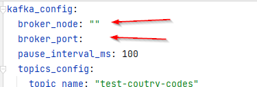
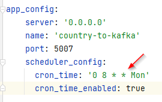
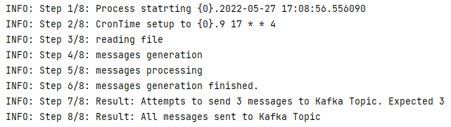
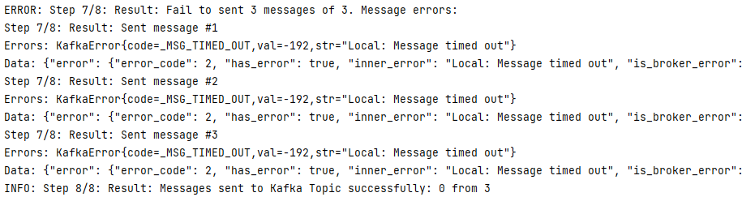

## Tags

**Python 3.8**, **Kafka**, **venv**, **docker**

## App motivation
This small python app loads a CSV file with 200+ rows and generate messages in a Kafka topic. The load/generation can be scheduled using a Cron Job.

## Requirements
- [Python Interpreter install](https://www.python.org/downloads/)
- [Docker Kafka Image](https://hub.docker.com/r/bitnami/kafka/)

## Environment
For you to be able to run the application follow this steps:

#### 1. Configure your [Virtual Environment](https://www.jetbrains.com/help/pycharm/creating-virtual-environment.html)
#### 2. Run setup/install requirements.txt
#### 3. Download and run the docker-kafka 
   
```
docker pull bitnami/kafka
```
## Build Steps
#### 1. Fill in the configuration file `./configuration/appcondifg.yaml`

#### 2. Define the cron time, **let it empty to run next minute**, or define a cron time using the cron [Cron language](https://crontab.guru/#0_8_*_*_1)

> in this example, we set it to 08:00 on Monday.

> if you don't want to schedule any cron, leave the cronTime empty `''`, with it, the cron will be set to run one minute after the app starts 

#### 3. Run the `./presentation_app/app.py`, see the logs to ensure it is running right

#### 4. In case of failure, the log will show something like that


## Author

- Ciro Matrigrani 
- ciromatrigrani@gmail.com
- [linked-in](https://www.linkedin.com/in/ciromatrigrani/?originalSubdomain=pt)
